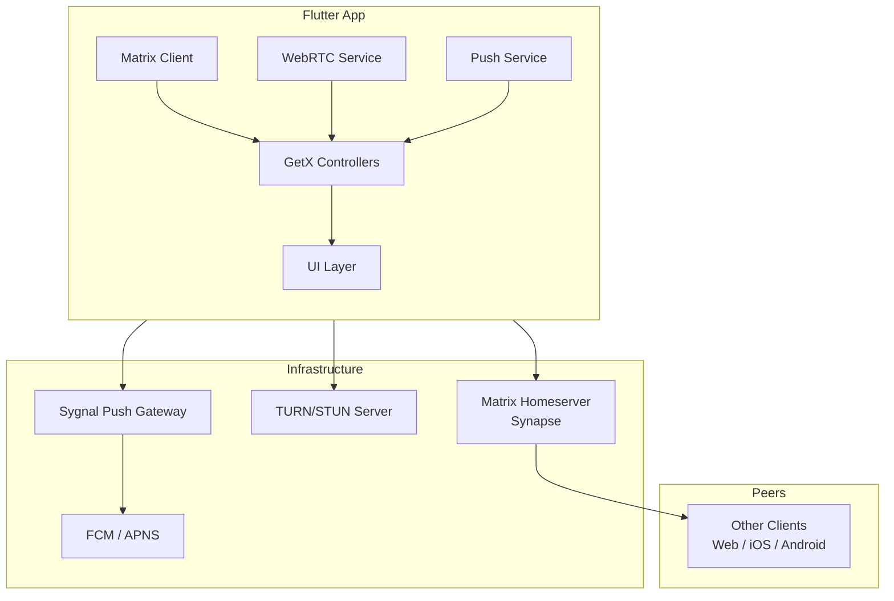
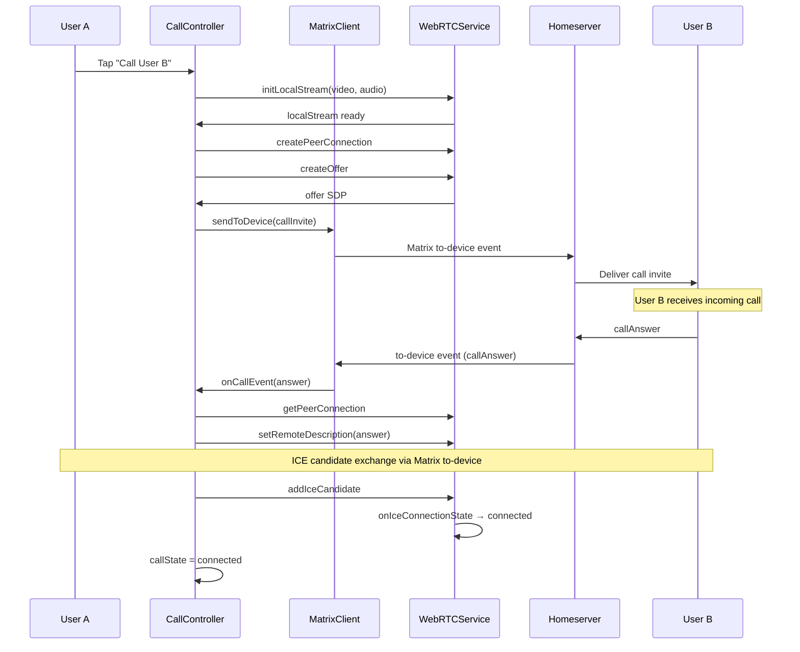
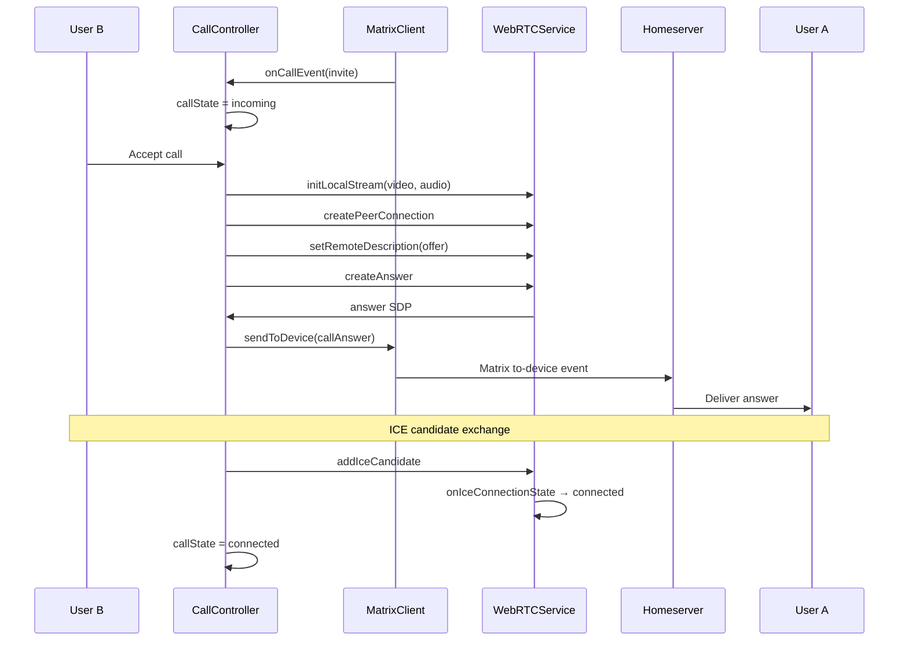

# Architecture Overview

## System Diagram



## Data Flow — Outgoing Call



## Data Flow — Incoming Call



## Layers

**Presentation Layer**
GetX controllers manage UI state. Pages observe Rx streams and rebuild accordingly. No business logic in widgets. The UI subscribes to `callState` and renders the appropriate screen (idle, outgoing, incoming, connected).

**Domain Layer**
CallController orchestrates the call lifecycle. It subscribes to Matrix to-device events, initiates WebRTC peer connections, and routes ICE candidates bidirectionally. Business rules are enforced here — cannot initiate a call if already connected, cannot accept if already in a call.

**Data Layer**
MatrixClient wraps the Matrix SDK with session persistence via the store interface. WebRTCService wraps peer connection lifecycle with stream-based event emission. Both are injected into controllers via GetX service locator.

## Event Routing Architecture

```
Matrix to-device events
        │
        ▼
MatrixClient._handleToDeviceEvent()
        │
        ├── callInvite  ──→ CallController._handleIncomingCall()
        ├── callAnswer  ──→ CallController._handleCallAnswer()
        ├── callHangup  ──→ CallController._handleRemoteHangup()
        ├── callReject  ──→ CallController._handleCallRejected()
        └── callCandidate ─→ CallController._onRemoteIceCandidate()
                                       │
                                       ▼
                              WebRTCService.addIceCandidate()
                                       │
                                       ▼
                              PeerConnection.addCandidate()
```

## Tech Stack

| Component | Technology | Purpose |
|-----------|------------|---------|
| Framework | Flutter 3.x | Cross-platform UI |
| State Management | GetX | Reactive controllers, DI, minimises boilerplate |
| Messaging Protocol | Matrix (matrix-dart-sdk) | End-to-end encrypted messaging, room management, presence |
| Media Pipeline | WebRTC (flutter_webrtc) | Peer-to-peer audio/video calling, screen sharing |
| Push Notifications | Sygnal + FCM | Matrix-compatible push delivery bridge |
| Local Storage | Isar | Session persistence, room history cache |
| Network Monitoring | connectivity_plus | Detect network transitions for reconnection |
